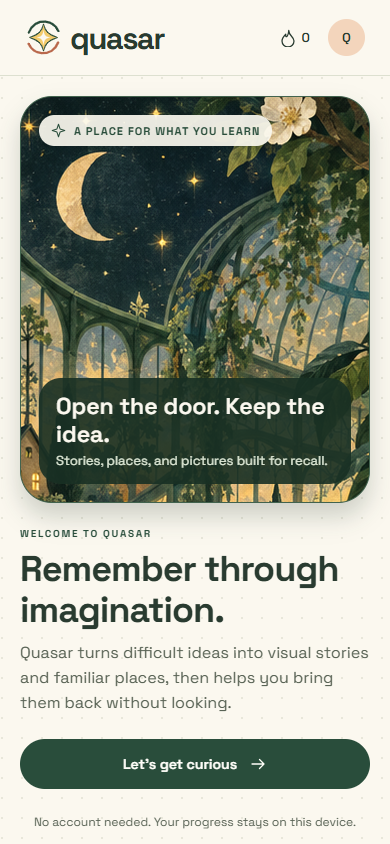

### Learn through places, pictures, and stories you can bring back without looking.

[Open the live demo](https://quasar-memory-garden.reyaattri4.chatgpt.site/) · [Watch the demo](docs/quasar-demo.webm) · [Read the release checklist](docs/RELEASE-CHECKLIST.md)

Quasar is a visual memory-learning app built with Expo and React Native. It turns difficult material into memorable scenes, guides learners through active recall, and schedules missed ideas for another look. The curriculum includes memory techniques, SAT vocabulary, biology, calculus, Korean, π, and interactive memory palaces.



## Why Quasar exists

Most study tools show the same explanation again. Quasar gives an idea somewhere to live: a room, an object, an action, and a retrieval path. Learners first understand the material in plain language, connect it to a distinct visual cue, recall it without the picture, and then apply it in context.

The experience is usable without an account. Progress stays on the device by default. Optional accounts add explicit cloud backup. Quasar Plus is designed to add personalized mnemonic generation without locking the core lessons behind a paywall.

## Product tour

- **Memory Toolkit:** six guided lessons covering association, chunking, story chaining, peg systems, active recall, and the method of loci.
- **Illustrated learning:** original, varied artwork tied to a specific fact instead of decorative repetition.
- **Memory worlds:** enterable Japanese, Egyptian, and cyberpunk routes with stable room and object anchors.
- **Learning studios:** structured biology and calculus lessons, Korean shape-and-sound practice, SAT context questions, and a 100-digit π route.
- **Review:** FSRS-backed scheduling, honest retry behavior, and local progress history.
- **Account control:** optional sign-up, sign-in, manual cloud backup, sign-out, local reset, analytics choice, and permanent account deletion.
- **Subscription lifecycle:** RevenueCat entitlement checks, live offering retrieval, purchase, restore, and store-managed subscription access.

## RevenueCat Shipaton 2026

Quasar is being prepared for the **Next Gen Award**, with the **RevenueCat Design Award** and **Peace Prize** as natural product fits if the final eligibility requirements are satisfied.

Official guidance requires a real RevenueCat-powered purchase or ads integration. General entries also need a first public store release during the event window. Next Gen entrants may use a public open-source repository and demo video instead of a store listing. Judges first see the description, screenshots, and the opening two minutes of the demo, so those materials are easy to find here.

| Requirement | Repository evidence | Status |
| --- | --- | --- |
| Mobile app with a valid package ID | Expo app, Android package `com.reyaattri.quasar` | Ready |
| RevenueCat SDK integrated | `react-native-purchases` and entitlement logic in `src/lib/services.ts` | Implemented |
| Real purchase or RevenueCat Ads | Offering, purchase, restore, and `quasar_pro` checks | **Needs store products, RevenueCat keys, and sandbox verification** |
| Public Next Gen source repository | This complete repository | **Ready — repository is public** |
| Demo video | `docs/quasar-demo.webm` | Ready; record a final build after purchase verification |
| Icon and screenshots | `assets/icon.png` and mobile captures in `docs/` | Ready; refresh final store captures after release build |
| Privacy, terms, and support | `public/privacy.html`, `public/terms.html`, `public/support.html` | Implemented in the web export |
| Account deletion | In-app deletion UI and authenticated Supabase Edge Function | Implemented; deploy the function before release |
| Installable, stable build | EAS profiles and Android workflow included | Needs final signed build and device QA |

This table is intentionally honest. SDK source code alone does not prove a working purchase. Quasar should not be submitted as purchase-verified until the current RevenueCat offering, store product, sandbox purchase, cancellation, and restore flow have all passed on a native build.

Official references: [Shipaton submission guide](https://www.shipaton.com/blog/how-to-submit-your-app-for-shipaton), [judging process](https://www.shipaton.com/blog/how-we-judge-shipaton), and [FAQ](https://www.shipaton.com/faq).

## Run locally

Use Node.js 22 or newer.

```bash
git clone https://github.com/reyaattri/Quasar.git
cd Quasar
npm ci
npm run web
```

The bundled lessons, artwork, audio, font, and local progress system run without service credentials. Native development requires the normal Expo and Android/iOS toolchain.

```bash
npm start
npm run android
```

## Verify the project

```bash
npm run typecheck
npm test
npm run test:e2e
npm run export:web
```

The unit suite validates π reconstruction, unique palace anchors, curriculum integrity, FSRS state transitions, immutable profile state, and database isolation. Browser tests cover mobile overflow, onboarding, learning, recall, worlds, Korean, calculus, medical lessons, and the toolkit conversation flow.

## Connected services

Copy `.env.example` to `.env` and add only the services you intend to test. Never commit secret keys.

- **Supabase:** optional authentication, user-scoped backups, generated mnemonics, and account deletion.
- **RevenueCat:** native offerings, purchases, restores, and the `quasar_pro` entitlement.
- **PostHog:** optional anonymous learning events controlled by the learner.
- **Anthropic / Replicate:** optional server-side personalized mnemonic text and images.

Detailed setup is in [docs/SETUP.md](docs/SETUP.md). Release gates are in [docs/RELEASE-CHECKLIST.md](docs/RELEASE-CHECKLIST.md).

## Project structure

| Path | Purpose |
| --- | --- |
| `App.tsx` | App shell, onboarding, navigation, settings, account and purchase flows |
| `src/features/` | Learning courses and memory activities |
| `src/components/` | Reusable visuals, rooms, interactions, and interface elements |
| `src/data/` | Curriculum, mnemonic cues, routes, and artwork mappings |
| `src/lib/` | Progress scheduling, persistence, Supabase, analytics, and RevenueCat |
| `assets/` | Bundled illustrations, audio, font, and app icon |
| `supabase/` | Database migration and authenticated Edge Functions |
| `public/` | Public privacy, terms, and support pages |
| `tests/` | Unit and phone-sized browser tests |
| `docs/` | Screenshots, demo, design notes, validation, and release documentation |

## Data and safety

Quasar stores guest progress locally. Cloud backup happens only for a signed-in learner who presses the backup button. Analytics are off unless the learner enables them. Personalized profile fields are sent to the generation endpoint only after the learner requests a personalized story. Cloud tables use per-user row-level security, and the server verifies RevenueCat entitlements instead of trusting a client flag.

Medical and biology material is educational and does not provide diagnosis or treatment. SAT practice is original and is not an official College Board question bank. Audio attribution and artwork provenance are documented in `assets/korean/credits.json` and [docs/ARTWORK.md](docs/ARTWORK.md).

## Release ownership

The repository contains the complete source and bundled assets needed for handoff. The owner still controls service accounts, signing keys, app-store records, product pricing, public repository visibility, and the final Shipaton submission. See [CLAUDE.md](CLAUDE.md) for a concise engineering handoff.
