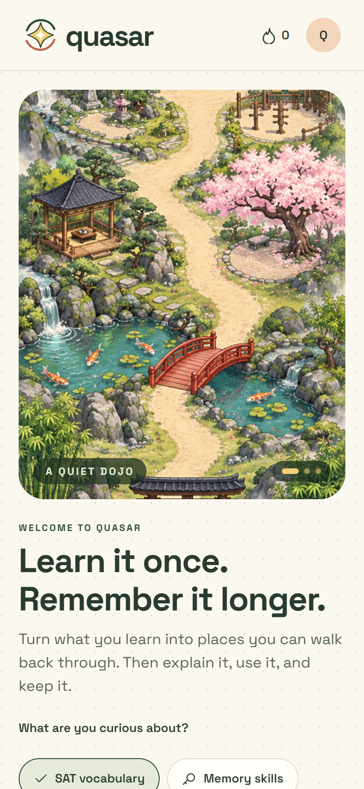
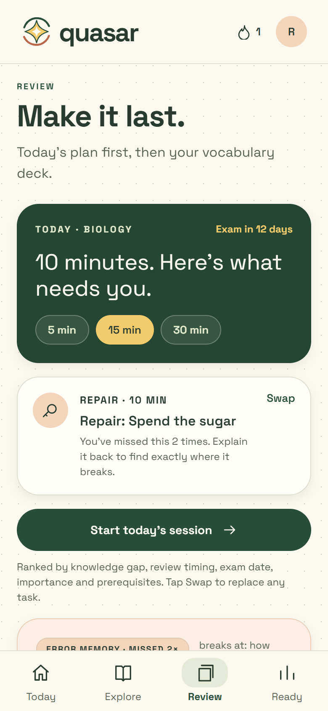
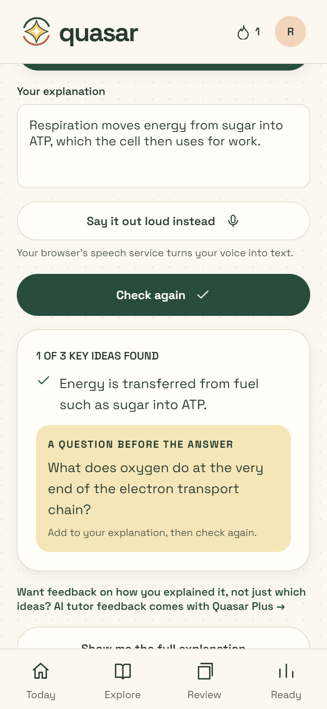
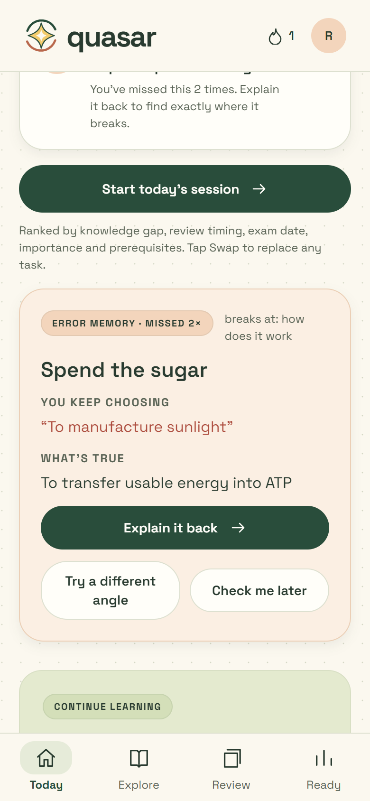
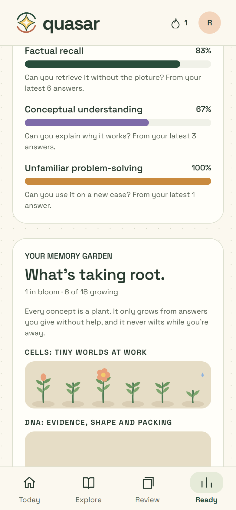
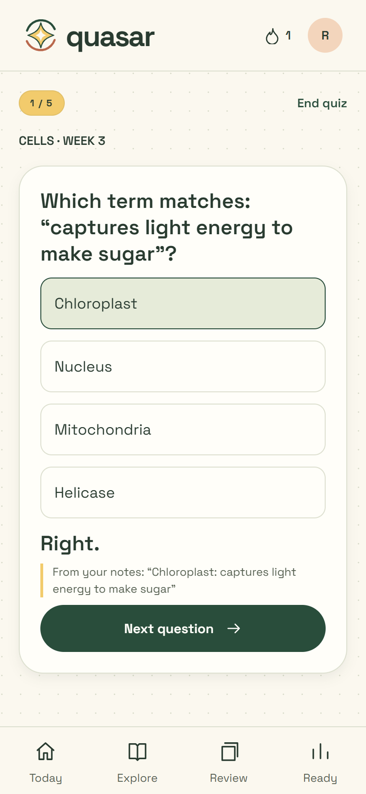
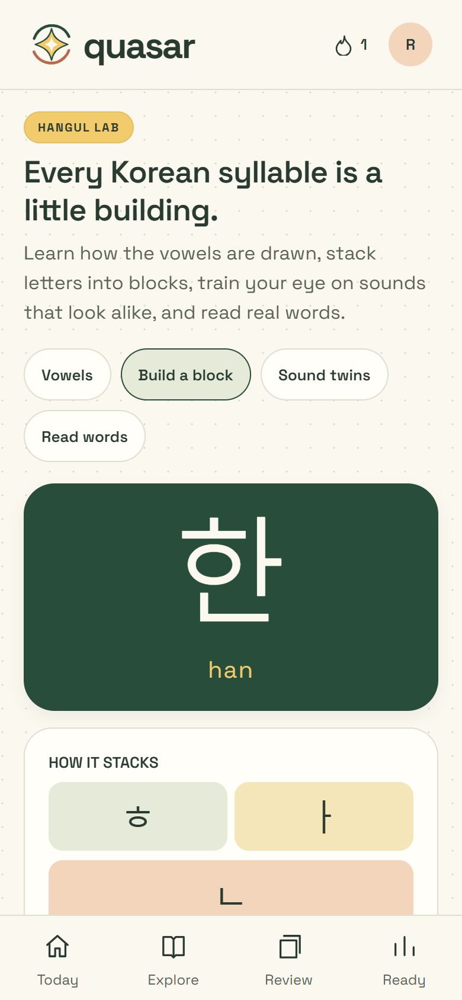

### Learn it once. Remember it longer.

[Open the live demo](https://quasar-memory-garden.reyaattri4.chatgpt.site/) · [Product vision](docs/PRODUCT-VISION.md) · [Design narrative](docs/DESIGN-NARRATIVE.md) · [Release checklist](docs/RELEASE-CHECKLIST.md)

Quasar is a visual memory-learning app built with Expo and React Native. It gives difficult ideas a place to live (a room, an object, a strange little story), then makes you **recall** them without the picture, **explain** them in your own words, **apply** them to something new, and **repair** exactly what keeps slipping.

<p>
  
  
  
  
  
</p>
<p>
  
  
</p>

## Why Quasar exists

Most study tools show the same explanation again. Quasar starts from how memory actually works: a vivid cue gives an idea somewhere to live, but understanding only counts when you can bring it back and use it **without help**. So every picture and story in the app leads to an unaided attempt, and every attempt feeds back into what you study next.

It works without an account. Progress stays on the device by default. The core lessons are free; Quasar Plus adds personalized stories, AI tutor feedback and AI quizzes from your notes without locking learning behind a paywall.

## The learning loop

| Pillar | What it does | Where |
| --- | --- | --- |
| **Today** | On the Review tab, ranks your next tasks using knowledge gaps, due reviews, exam date, importance and prerequisites. Fits them to 5, 15 or 30 minutes and explains every pick; any task can be swapped. After a break, **Recovery Mode** welcomes you back with a small, review-first plan and says what it set aside. Home shows a single link to the session. | `src/lib/planner.ts`, `src/features/TodayPlan.tsx` |
| **Memory Worlds** | Walkable dojo, ruins and neon palaces; illustrated biology, SAT, calculus, Korean and π courses. The Korean course adds a **Hangul Lab**: how the vowels are drawn, a syllable-block builder with batchim, look-alike sound drills (ㄱ/ㅋ/ㄲ, ㅓ/ㅗ…) that remember your mix-ups, and 20 real words to read. | `src/features/MemoryPalace.tsx`, `src/features/HangulLab.tsx` and the course folders |
| **Teach-Back** | The lesson hides and you explain it, by typing or, in supporting browsers, by speaking. Missing ideas come back as a *why* question, not the answer. Then you defend it with a follow-up question. Quasar Plus adds **AI tutor feedback** on how you explained it. | `src/features/TeachBack.tsx`, `supabase/functions/grade-explanation` |
| **Why Ladder** | Five rungs: what → why → how → what if it fails → use it somewhere new. It records where your understanding breaks. | `src/features/WhyLadder.tsx` |
| **Case Lab** | Six original two-attempt field cases, two per lesson, on their own page and at the end of each lesson. | `src/features/CaseLab.tsx`, `src/data/caseLab.ts` |
| **Error Memory** | Miss a concept twice and Quasar shows the exact answer you keep choosing next to what's true, offers other angles, and waits for a correct unaided answer before clearing it. | `src/lib/learning.ts`, `src/features/ErrorMemory.tsx` |
| **Ready** | Separate meters for factual recall, conceptual understanding and unfamiliar problem-solving. Only answers given without a hint count as mastered, and nothing is estimated. | `src/features/Ready.tsx` |
| **Notes → Quiz** | Paste notes or choose a .txt, .md or PDF file. A free quick quiz is built on your device from "Term: definition" lines and key sentences. Quasar Plus adds AI quizzes whose questions each quote the line they come from; for pasted text, questions that can't be traced back are dropped. Every question returns for spaced review. | `src/features/NotesQuiz.tsx`, `src/lib/noteQuiz.ts`, `supabase/functions/generate-quiz` |
| **Memory Garden** | Each concept is a plant: planted when you try it, leaves on an unaided recall, a bud once you explain it, a bloom after recall on two different days. It never wilts while you're away. | `src/features/MemoryGarden.tsx` |

The loop currently runs on the three biology lessons (18 concepts). Spaced review uses [FSRS](https://github.com/open-spaced-repetition/ts-fsrs) throughout. Teach-Back checks explanations on the device against authored key ideas, by keyword; the app says so, and that check decides what counts as mastered. The optional AI tutor (Quasar Plus) is advice on top: it runs on the server with Claude and needs the Supabase, RevenueCat and Anthropic setup in [docs/SETUP.md](docs/SETUP.md).

What's built versus planned (Quasar Originals, social features, exam tracks and more) is listed in [docs/PRODUCT-VISION.md](docs/PRODUCT-VISION.md).

## RevenueCat Shipaton 2026

Quasar is being prepared for the **Next Gen Award**. The **RevenueCat Design Award** is a natural fit too; see [docs/DESIGN-NARRATIVE.md](docs/DESIGN-NARRATIVE.md). Next Gen entrants submit a demo video, a public open-source repository with a license, and a description; a store release isn't required.

| Requirement | Repository evidence | Status |
| --- | --- | --- |
| Public open-source repository | This repository | **Ready** |
| Open-source license | [`LICENSE`](LICENSE) (MIT) | **Ready** |
| Clear description of what was built | This README, [product vision](docs/PRODUCT-VISION.md), [design narrative](docs/DESIGN-NARRATIVE.md) | **Ready** |
| Mobile app with a valid package ID | Expo app, `com.reyaattri.quasar` | Ready |
| RevenueCat SDK integrated | `react-native-purchases` with offerings, purchase, restore and `quasar_pro` entitlement checks in `src/lib/services.ts`. Plus unlocks personalized stories, AI tutor feedback and AI quizzes, all checked server-side against RevenueCat in `supabase/functions/` | Implemented |
| A real purchase through RevenueCat | Needs store products, RevenueCat keys and a sandbox purchase on a native build | **Not yet verified** |
| Demo video (under 2 minutes) | Script in [docs/DEMO.md](docs/DEMO.md) | **To record**; the older `docs/quasar-demo.webm` predates the learning loop |
| Student eligibility | Academic email, age and guardian consent are confirmed by the entrant on Devpost | Owner action |
| Privacy, terms and support | `public/privacy.html`, `public/terms.html`, `public/support.html` | Implemented in the web export |
| Account deletion | In-app deletion UI and an authenticated Supabase Edge Function | Implemented; deploy the function before release |

This table is intentionally honest. SDK code alone doesn't prove a working purchase. Don't describe Quasar as purchase-verified until the current offering, a sandbox purchase, cancellation and restore have all passed on a native build.

Official references: [Next Gen Award](https://www.shipaton.com/categories/next-gen-award), [Design Award](https://www.shipaton.com/categories/revenuecat-design-award), [submission guide](https://www.revenuecat.com/blog/engineering/how-to-submit-your-app-for-shipaton), [FAQ](https://www.shipaton.com/faq).

## Run locally

Use Node.js 22 or newer.

```bash
git clone https://github.com/reyaattri/Quasar.git
cd Quasar
npm ci
npm run web
```

The lessons, artwork, audio, font, learning loop and local progress all run without service credentials. Native development needs the usual Expo and Android/iOS toolchains (`npm start`, `npm run android`).

## Verify the project

```bash
npm run typecheck
npm test
npm run test:e2e
npm run export:web
```

The 28 unit tests cover:
- the notes quick-quiz builder, and Hangul block composition and romanization
- the Today planner: priority weights, time budgets, prerequisites, swapping and Recovery Mode
- Memory Garden growth rules and the Case Lab cases
- Error Memory detection and resolution
- Ready's measures, and Teach-Back rubric matching
- FSRS scheduling for biology concepts, and migration of older saved progress
- π reconstruction and palace anchors
- curriculum integrity and database row-level security

Browser tests cover onboarding, learning, recall, worlds, the courses, and the full loop (Error Memory, Teach-Back, repair, Ready, the Memory Garden, Case Lab and Recovery Mode) at phone size. `node scripts/capture-screens.cjs` regenerates the README screenshots.

## Connected services

Copy `.env.example` to `.env` and fill in only the services you want to test. Never commit secret keys.

- **Supabase:** optional sign-in, user-scoped backups, generated mnemonics and account deletion.
- **RevenueCat:** native offerings, purchases, restores and the `quasar_pro` entitlement.
- **PostHog:** optional anonymous learning events, controlled by the learner.
- **Anthropic / Replicate:** optional server-side personalized mnemonic text and images.

Setup is in [docs/SETUP.md](docs/SETUP.md).

## Project structure

| Path | Purpose |
| --- | --- |
| `App.tsx` | App shell, onboarding, navigation, settings, account and purchase flows |
| `src/features/` | Courses, Hangul Lab, Notes → Quiz, Teach-Back, Why Ladder, Case Lab, Today plan, Error Memory, Ready, Memory Garden |
| `src/lib/` | Progress and FSRS scheduling, learning history and Error Memory (`learning.ts`), the Today planner (`planner.ts`), services |
| `src/data/` | Curriculum, Teach-Back key ideas and Why Ladders (`biologyUnderstanding.ts`), mnemonic cues and artwork mappings |
| `src/components/` | Design system (`ui.tsx`), motion (`Reveal.tsx`), rooms, scenes and interface elements |
| `assets/` | Original illustrations, audio, font and the app icon |
| `supabase/` | Database migration and authenticated Edge Functions |
| `public/` | Public privacy, terms and support pages |
| `tests/` | Unit tests and phone-sized browser tests |
| `docs/` | Vision, design narrative, demo script, screenshots, setup and release notes |

## Data and safety

- **Storage:** guest progress, including the learning history behind Error Memory and Ready, stays on the device. Cloud backup happens only when a signed-in learner presses the backup button.
- **Analytics:** off unless the learner turns them on.
- **Personalization and AI feedback:** profile fields go to the generation endpoint only when the learner asks for a personalized story, a Teach-Back explanation goes to the AI tutor only when a Plus member presses its button, and notes go to the AI only for an AI quiz; quick quizzes are built on the device. Voice dictation uses the browser's own speech service, only while switched on.
- **Entitlements:** the server checks RevenueCat directly and never trusts a flag sent by the client.
- **Content:** biology material is educational, not diagnosis or treatment. SAT practice is original, not an official College Board question bank. Artwork and audio provenance are documented in [docs/ARTWORK.md](docs/ARTWORK.md) and `assets/korean/credits.json`.

## License

The source code is released under the [MIT License](LICENSE). Bundled third-party media (fonts, audio, reference imagery) keeps its own license and attribution, recorded in `docs/ARTWORK.md` and `assets/korean/credits.json`.
