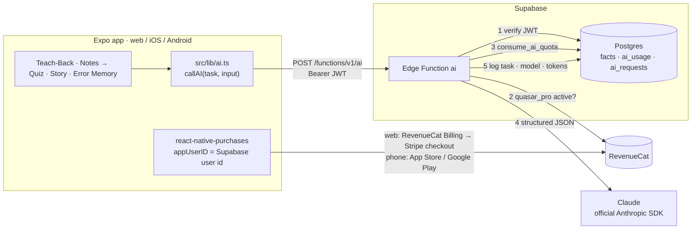

# quasar

### Learn it once. Remember it longer.

Most study apps show you the same explanation twice and call that review. Quasar does something else: it gives every hard idea an actual place to live (a room, a character, a strange little story) and then makes you prove you can bring it back without looking. Recall it, explain it in your own words, use it on something you've never seen. That's the whole loop, and it repeats across every subject in the app.

Built with Expo and React Native, one codebase for iOS, Android and the web. Open source under the MIT license. This is my entry for the **RevenueCat Shipaton 2026, Next Gen Award**. Try it live, no account needed: **[reyaattri.github.io/Quasar](https://reyaattri.github.io/Quasar/)**

## What's inside

- **Cell City:** a six-episode biology story where you solve a city-wide blackout by learning how a real cell makes energy. An illustrated atlas of six districts, a cast of characters who react to every answer, real glycolysis and the citric acid cycle underneath all of it.
- **The memory toolkit:** memory palaces, number pegs, the Major System, taught through short illustrated conversations instead of a wall of text.
- **Courses:** vocabulary, biology, calculus, the digits of π, and Korean, where a Hangul Lab and a sentence trail take you from building syllables to real conversation.
- **Notes → Quiz:** paste your own notes and Quasar turns them into highlighted study sections and flashcards first, then a quiz that comes back later for spaced review.
- **Today:** plans each session around what you're closest to forgetting, what's due, and your exam date, fit into 5, 15, or 30 minutes.
- **Teach-Back** hides the lesson while you explain it, **the Why Ladder** finds exactly where your understanding breaks, and **Case Lab** hands you a problem you've never seen.
- **Error Memory** names the specific wrong answer you keep choosing and keeps offering new angles until you get it right on your own.
- **Ready and the Memory Garden** track recall, understanding, and application as three separate things. A concept only blooms once you've nailed it, unaided, on two different days.
- **Quasar Plus** adds an AI tutor, AI quizzes built from your own notes or PDFs, personalized stories, and fresh memory hooks, all generated by Claude on the server. It's open access right now: every AI feature works for free during the Shipaton launch window.

Spaced review runs on [FSRS](https://github.com/open-spaced-repetition/ts-fsrs). A hinted answer never counts as mastered. Progress stays on your device unless you choose to back it up.

## How it thinks

Six questions, one per pillar, each one built and shipped in this repo:

| Pillar | The question it answers |
| --- | --- |
| **Today** | What should I study, and why? A planner ranks every task by a real priority formula, explains its pick in plain language, and rebuilds a small, forgiving plan after a few days away instead of dumping a backlog. |
| **Memory Worlds** | How do I make this unforgettable? *The Secrets of Cell City*, walkable palaces, fading cues, and a full illustrated atlas. |
| **Teach-Back** | Can I explain it without help? The lesson hides, you write or speak the answer, and an AI tutor quotes your own words back to you. |
| **Case Lab** | Can I actually use it? Original two-attempt field cases, one per lesson. |
| **Memory Debugger** | Why do I keep getting this wrong? Error Memory names the exact misconception and writes a new hook aimed right at it. |
| **Ready** | What can I genuinely remember? Three separate meters, no invented scores, a garden that only grows from unaided success. |

Today's priority formula, for the curious:

```
P = 100 × (0.25·K + 0.25·R + 0.20·E + 0.20·I + 0.10·U)
```

K is the knowledge gap, R is review urgency from FSRS, E is exam proximity, I is authored importance, U is prerequisite value. One slot is always reserved for a due review, no plan repeats a task type more than twice, and every task says why it was picked. Built in `src/lib/planner.ts`, tested in `tests/learning.test.ts`.

A few rules run through all of it: the real explanation always sits next to the memory cue, because an inaccurate mnemonic just makes misinformation stick better. A hinted answer never counts as mastered. Empty states say "not tested yet" instead of faking a zero. Nothing blocks a study session waiting on a network, because the core loop never depends on one.

## The AI, for real

Quasar Plus runs on a real gateway, not a demo stub. Four things decide whether an AI feature runs and what comes back: your signed-in account, a RevenueCat entitlement (or the launch-window open-access flag), a daily quota, and a validated call to Claude. The core app never depends on any of it, every AI feature has a working on-device fallback.


```mermaid
flowchart LR
  subgraph App["Expo app · web / iOS / Android"]
    UI["Teach-Back · Notes → Quiz · Story · Error Memory"]
    AI["src/lib/ai.ts<br/>callAI(task, input)"]
    RC["react-native-purchases<br/>appUserID = Supabase user id"]
    UI --> AI
  end
  AI -- "POST /functions/v1/ai<br/>Bearer JWT" --> GW
  RC -- "web: RevenueCat Billing → Stripe checkout<br/>phone: App Store / Google Play" --> RCS[(RevenueCat)]
  subgraph Supabase
    GW["Edge Function ai"]
    DB[("Postgres<br/>facts · ai_usage · ai_requests")]
  end
  GW -- "1 verify JWT" --> DB
  GW -- "2 quasar_pro active?" --> RCS
  GW -- "3 consume_ai_quota" --> DB
  GW -- "4 structured JSON" --> CL["Claude<br/>official Anthropic SDK"]
  GW -- "5 log task · model · tokens" --> DB
```

Every request is checked before it costs anything: the server asks RevenueCat directly whether the account has an active `quasar_pro` entitlement (the client never gets a say, a flag sent from the app is ignored), a per-feature daily quota is enforced atomically in Postgres, and Claude is called through the official Anthropic SDK with a strict JSON schema so answers always come back in the expected shape.

| Task | What it does | How it's kept honest |
| --- | --- | --- |
| `tutor` | Grades a Teach-Back explanation | Only a literal match counts as covered. Advice only, the on-device check still decides mastery. |
| `quiz` | Writes a quiz from your notes | A question whose source quote isn't actually in your notes gets dropped. |
| `story` | Personalizes a mnemonic | Fact text comes from the database, never the client. |
| `hook` | Writes a new memory hook for a repeated mistake | Must state the correct idea in words. Saved beside the old cue, never silently replaces it. |

Everything a student writes is treated as data, never instructions, the system prompt tells Claude explicitly not to follow anything inside it. More detail on the gateway, the quotas, and how to connect real keys lives in `docs/AI-ARCHITECTURE.md` and `docs/GO-LIVE.md`.

## Built for the Shipaton Next Gen Award

This is my submission to **RevenueCat Shipaton 2026**, Next Gen category. Quasar Plus runs on the real RevenueCat SDK, the app stores handle billing on phones and RevenueCat Billing handles it on the web, and nothing about the entitlement check is faked. A guided, 45-minute walkthrough for setting up a real sandbox purchase is in `docs/GO-LIVE.md`. The demo video follows `docs/DEMO.md`.

## Deployment

The live site is built straight from this repository and served off the `gh-pages` branch, no third-party hosting account involved:

```bash
npm run export:gh-pages
```

That runs the normal Expo web export, then `scripts/rewrite-base-path.cjs`, which fixes the root-absolute asset and font paths Expo bakes in so they resolve correctly from a GitHub Pages project subpath instead of assuming the domain root. The result is committed straight to `gh-pages`.

## Run it

Node.js 22 or newer. The lessons, art, and learning loop all work with zero keys and zero account.

```bash
git clone https://github.com/reyaattri/Quasar.git
cd Quasar
npm ci
npm run web
```

`npm start` opens the same app in Expo for iOS and Android. Optional services (Supabase, RevenueCat, Anthropic) are set up in `docs/SETUP.md`.

```bash
npm run typecheck
npm test
npm run test:e2e
```

Unit tests cover the planner, spaced review, Error Memory, the notes quiz, Cell City, Hangul, and the database rules. The browser suite walks the main flows at phone size.

## Privacy

Quasar works with no account. Analytics stay off unless you turn them on yourself. Your notes or explanations only reach the AI the moment you press an AI button, never before.

## License

MIT (see `LICENSE`). Bundled fonts, audio, and artwork keep their own licenses and provenance, recorded in `docs/ARTWORK.md` and `assets/korean/credits.json`.
