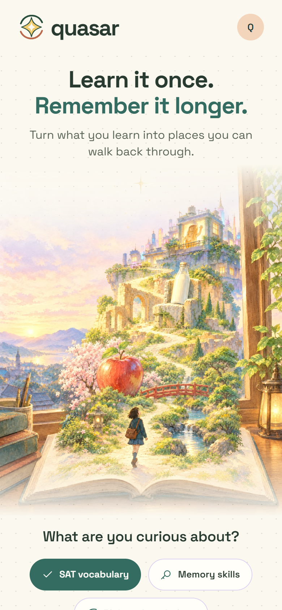
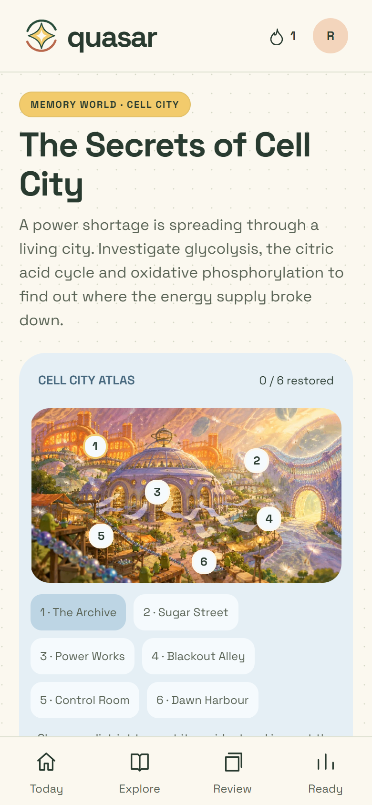
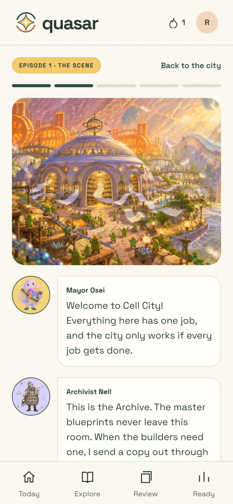
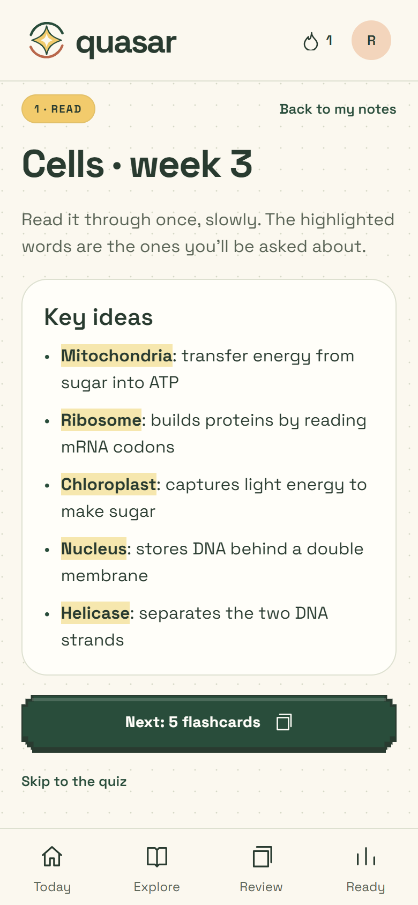
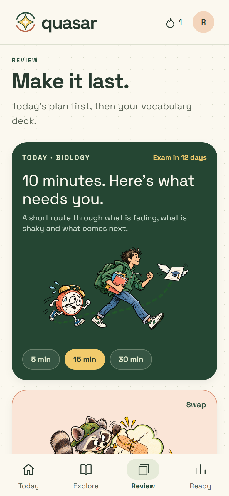
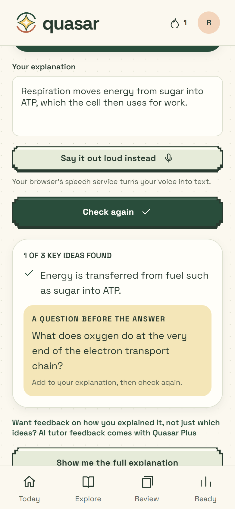
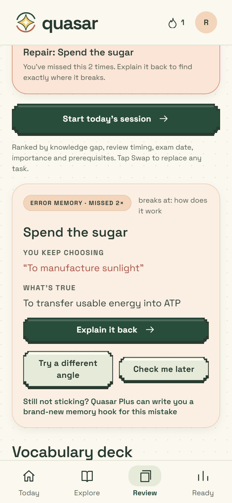
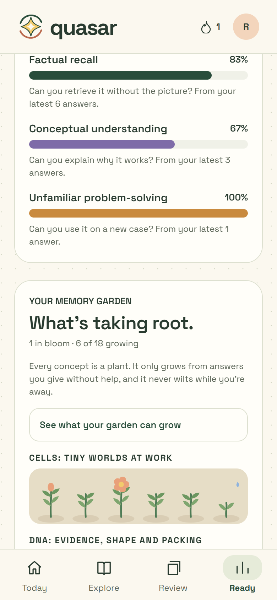
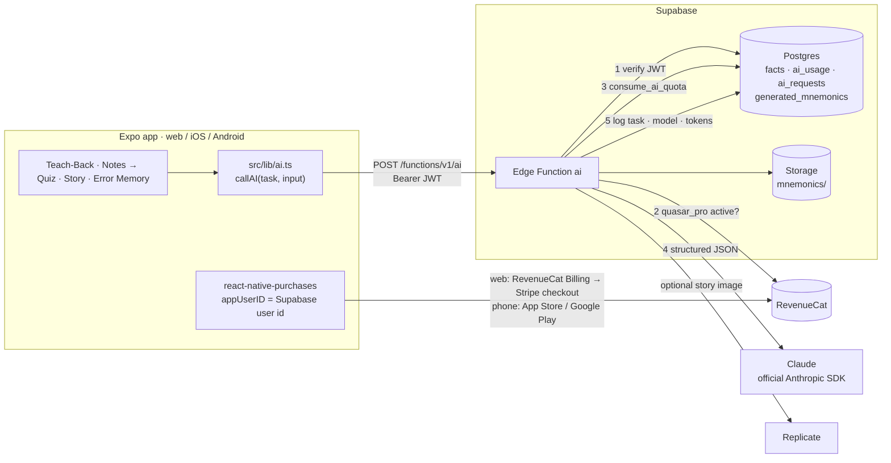

# quasar

### Learn it once. Remember it longer.

Quasar is a visual memory-learning app that gives every hard idea a place to live: a room, a character, a strange little story you can walk back through. It doesn't stop at showing you the idea once. It asks you to recall it without help, explain it in your own words, and then use it on a problem you haven't seen before. That's the whole loop, repeated across every subject in the app.

It's built with Expo and React Native, so the same codebase runs on iOS, Android and the web. The source is public here under the MIT license, and this is my entry for the RevenueCat Shipaton 2026 Next Gen Award. You can try it right now in the browser at reyaattri.github.io/Quasar, no account needed.

<p>
  
  
  
  
</p>
<p>
  
  
  
  
</p>

## What's inside

- **Cell City** is a six-episode biology story where you solve a blackout inside a living cell, exploring an illustrated atlas of districts and learning glycolysis, the citric acid cycle and ATP synthase with a cast of characters who react to every answer.
- **The memory toolkit** teaches memory palaces, number pegs, the Major System and other techniques through short illustrated conversations.
- **Courses** cover SAT vocabulary, biology, calculus, the digits of π and Korean, where a Hangul Lab and a sentence trail take you from building syllables to six everyday expressions.
- **Notes → Quiz** turns your own notes into highlighted study sections and flashcards first, then a quiz built on your device that comes back for spaced review.
- **Today** plans each session around what you're closest to forgetting, what's due and your exam date, fitted to 5, 15 or 30 minutes.
- **Teach-Back** hides the lesson while you explain it, **the Why Ladder** finds exactly where your understanding breaks, and **Case Lab** asks you to use the idea on a problem you haven't seen.
- **Error Memory** names the wrong answer you keep choosing and offers new angles until you get it right on your own.
- **Ready and the Memory Garden** measure recall, understanding and application separately, and each idea only blooms once you've answered it without help on two different days.
- **Quasar Plus** adds an AI tutor, AI quizzes from your notes or PDFs, personalized stories and fresh memory hooks, generated by Claude on the server. It's currently open access: every AI feature works for free during this launch window, no RevenueCat subscription required yet.

Spaced review runs on [FSRS](https://github.com/open-spaced-repetition/ts-fsrs), answers given with a hint never count as mastered, and progress stays on your device unless you choose to back it up.

## Product vision

**Learn it once. Remember it longer.**

Quasar turns what a student is learning into a connected, personal memory universe. Learners explore it through illustrated stories and walkable worlds, teach the ideas back, apply them to unfamiliar problems, and come back at exactly the points where their understanding breaks.

Quasar shouldn't become a generic AI study planner with a few memory games attached. Every creative experience in the app has to lead somewhere: to recalling, explaining or applying the idea without help.

### The six pillars

| Pillar | The student's question | Status in this repository |
| --- | --- | --- |
| **Today** | What should I study, and why? | **Built for biology** (on the Review tab). A rule-based planner ranks tasks with the priority formula below, fits them to 5, 15 or 30 minutes, respects prerequisites, takes an optional exam date into account, explains every pick and lets the student swap any task. **Recovery Mode** takes over after three days away or a backlog of reviews more than a day overdue: a small review-first plan that says how many items it set aside. |
| **Memory Worlds** | How do I make this unforgettable? | **Built.** *The Secrets of Cell City*, a six-episode story world (cell structures and cellular respiration) with six recurring characters, rebuild-from-memory games, evidence-based reasoning and fading cues. Walkable dojo, ruins and neon palaces with stable room anchors; illustrated biology, SAT, calculus, Korean and π courses. *Planned:* more story worlds, worlds generated from uploaded material, and characters shared across subjects. |
| **Teach-Back** | Can I explain it without help? | **Built.** The lesson is hidden and the student writes or, in supporting browsers, speaks an explanation. Quasar checks it on the device against three authored key ideas, asks a *why* question about the first missing one instead of revealing it, allows one retry, then asks a follow-up question to defend it. **AI tutor feedback** (Quasar Plus) reviews how the idea was explained, flags wrong claims and asks one more question, through a server function that needs Supabase, RevenueCat and Anthropic keys. *Planned:* voice on native builds, and diagram reconstruction. |
| **Case Lab** | Can I use it to solve a problem? | **Built (first set).** Six original two-attempt field cases, two per biology lesson, on their own page; every attempt is logged and Today schedules the unsolved ones. The Why Ladder's final rung is also an unfamiliar application question. *Planned:* multi-step simulations. |
| **Memory Debugger** | Why do I keep getting this wrong? | **Built.** Error Memory surfaces any concept missed twice, names the exact wrong answer the student keeps choosing next to what's true, offers alternative explanations (saving the one that helped) and schedules a re-check. It only resolves after a later correct answer given without help. With Quasar Plus, the AI writes a **self-repairing mnemonic**: a new hook aimed at that exact misconception, saved beside the old cue until the learner chooses it. |
| **Ready** | What can I genuinely remember and use? | **Built.** Separate meters for factual recall, conceptual understanding and unfamiliar problem-solving, computed only from the learner's own answers, alongside open and repaired mistakes. No score prediction. The **Memory Garden** shows every concept as a plant that grows only from unaided success and blooms after recall on two different days. |

The Why Ladder (the "Why Engine") runs across all three biology lessons: *What happens → Why → How it works → What if it fails → Use it somewhere new.* Quasar records the rung where understanding breaks.

### The learning journey

1. **Start without friction.** No account needed: pick a subject and begin.
2. **Make it memorable.** Illustrated scenes, memory palaces and strange, specific cues.
3. **Explain it yourself.** Teach-Back and the Why Ladder.
4. **Apply it.** Field cases and new-situation questions.
5. **Repair, recall, retain.** Error Memory, FSRS-scheduled review, and a Today plan that brings back what's slipping.

### How Today decides

Each concept gets a priority score:

```
P = 100 × (0.25·K + 0.25·R + 0.20·E + 0.20·I + 0.10·U)
```

| Factor | Meaning | How it's measured today |
| --- | --- | --- |
| K: knowledge gap | Recent evidence the concept isn't mastered | 1 when there's an unresolved recurring error; otherwise 1 minus the share of the last three attempts answered correctly without help; 0.5 when the concept hasn't been tried yet |
| R: review urgency | Due for retrieval practice | FSRS due date; grows as it becomes overdue |
| E: exam proximity | Time left before the exam | `1 − days/30` once an exam is set |
| I: importance | Course relevance | Authored per concept |
| U: prerequisite value | Unlocks later topics | Higher for earlier lessons |

These weights are starting assumptions, not tuned parameters. On top of the score:
- One slot is reserved for a due review.
- A plan holds at most two tasks of the same type.
- No Case or Why task appears before the lesson's concepts have been tested.
- Every task shows why it was chosen.

Implementation: `src/lib/planner.ts`, tested in `tests/learning.test.ts`.

### Design principles

- **Accuracy before memorability.** An inaccurate mnemonic makes misinformation memorable. The real explanation always sits next to the cue.
- **Honest measurement.** Answers given with a hint don't count as mastered. Keyword checks are labelled as keyword checks, not AI grading. Empty states say "not tested yet" instead of inventing numbers.
- **Independence over dependence.** Hints come as questions first. Asking for the full answer is always possible, but it's recorded as help.
- **Welcoming, not punishing.** A missed day doesn't erase progress; Today simply rebuilds a plan that fits the time available.
- **Speed.** Reviews and plans are computed on the device and are ready instantly; nothing blocks a study session while waiting on a network.

### Roadmap

**Phase 1: prove the core loop (in this repository).** Frictionless onboarding, memory worlds, biology lessons, the Cell City story world, Notes → Quiz (study your notes and flashcards first, then a free on-device quiz, plus Plus AI quizzes from text or PDF with source quotes), the Hangul Lab, Teach-Back (with voice and the Plus AI tutor), the Why Ladder, Case Lab, Error Memory, Today with Recovery Mode, Ready and the Memory Garden.

**Phase 2: adaptive learning.**
- Deeper import: slides and lecture recordings, and turning notes into full concepts with key ideas, not just quiz questions.
- Alternative mnemonics compared over delayed tests.
- More field cases.

**Phase 3: depth and exam preparation.**
- Foundation, exam-depth and advanced-reasoning modes.
- Syllabus-aligned tracks.
- A fuller Ready dashboard with delayed-retention results.

**Phase 4: the wider universe.**
- Connected worlds across subjects and personal memory palaces.
- Art Style Studio: storybook and doodle styles exist today; pixel, animated and 3D are planned.
- A wider Memory Garden across subjects, plus optional social sharing.
- *Quasar Originals*: more illustrated story worlds like *The Secrets of Cell City* (built), with animated characters (see `docs/ART-PIPELINE.md`).

### How we'll know it works

Planned validation:
1. Student interviews.
2. A small pilot.
3. A comparison between an ordinary study method, Quasar without memory worlds, and full Quasar.

Measures:
- unaided recall after 7 and 30 days
- performance on unfamiliar questions
- recurring-mistake rates
- study time
- retention
- willingness to pay

The goal is to learn whether each part improves learning, not just whether it looks appealing.

### Business model

- **Free:** the core lessons, memory worlds, reviews, Teach-Back, the Why Ladder, Error Memory and Ready. Learning is never paywalled.
- **Quasar Plus:** personalized mnemonic stories and illustrations generated from the learner's own interests, AI tutor feedback on Teach-Back explanations, and AI quizzes from uploaded notes, all verified server-side through RevenueCat's `quasar_pro` entitlement. Prices come from the store, and willingness to pay is something to test, not assume.

## Design narrative

Quasar is designed around one idea: **a memory needs somewhere to live, and a learner needs to find it again without help.** Every screen is meant to either give an idea a vivid place or make the learner retrieve it unaided. Here are the choices judges should look at, and the reasons behind them.

### Visual language

- **Warm paper, forest green, sage and one yellow accent.** It should read like a well-made notebook rather than a dashboard: calm enough for long sessions, and warm enough that coming back feels inviting. Tokens live in `src/components/ui.tsx`, with one type scale (Space Grotesk, 36/26/22/16/12) used everywhere.
- **Original illustration, not decoration.** Each picture shows the specific object or relationship the learner needs to remember. There are no generic mascots or emoji. Different subjects get different styles: ink cartoons for SAT, gouache for biology, pixel worlds for memory palaces.
- **Hand-drawn SVG icons** in a single stroke weight, so the interface feels drawn rather than assembled.

### Screens worth a closer look

#### 1. Landing: a notebook that turns into a world
`src/components/WelcomeScene.tsx` · `docs/landing-mobile.png`

The first screen shows no feature list. A centered headline (*Learn it once. Remember it longer.*) sits above a single painting: a notebook whose pages grow into a path through the three memory worlds, past the app's first memory cues (an apple, a milk bottle on a chair, a loaf of bread waving from a window). The painting fades out at both ends through a transparency mask, so it floats on the dotted paper with no frame. Subject chips and a pixel-style button sit below it, and no account is needed to start.

#### Buttons that press like a game
`src/components/ui.tsx`

Every button has stepped pixel corners and a hard shadow it sinks into when pressed. They're drawn in SVG from the button's measured size, so the label stays native text that screen readers and tests can find.

#### Cell City: characters in their own styles
`src/features/CellCity.tsx` · `docs/cell-city-mobile.png`, `docs/cell-city-scene-mobile.png`

Each of the six characters is drawn in a different style, chosen to match their role: a hand-painted mayor, an ink-sketch archivist, pixel-art builders and courier, lo-fi neon for the power station and the city wall. Each has an idle, worried and happy pose, and after every answer the episode's host reacts in their own voice. An illustrated atlas lets you open each district of the city before its episode. The real biology is always stated before the city metaphor.

#### 2. Today: a plan with its reasons shown
`src/features/TodayPlan.tsx` · `docs/today-plan-mobile.png`

Home stays calm: a greeting, the lesson to continue, and one slim *Today's session* row. The plan itself lives on the Review tab, where studying happens. There, a dark hero card asks one question: how much time do you have? Choosing 5, 15 or 30 minutes rebuilds the plan instantly. Each task shows its type, its length and one plain sentence explaining why it was chosen. Swap sits outside the task's tap target, so a learner never starts a task by accident. After a break, the card changes its headline to *Welcome back. Let's start small.*, says how long it's been and that nothing is lost, and names how many reviews it set aside, instead of dumping a backlog. The planner's formula is written up above, under Product vision.

#### 3. Teach-Back: a question before the answer
`src/features/TeachBack.tsx` · `docs/teach-back-mobile.png`

The lesson disappears, and a dark "The lesson is hidden" card holds the prompt. After a check, the ideas the learner covered are ticked. The missing ideas stay hidden. Instead, a yellow card asks a guiding question about the first one ("What does oxygen do at the very end of the electron transport chain?"). The design never makes the answer the easy path: revealing it is always possible, but it's recorded as help. The label says plainly that this is a keyword check, not AI grading.

#### 4. Error Memory: naming the misconception
`src/features/ErrorMemory.tsx` · `docs/error-memory-mobile.png`

When a concept slips twice, a peach card appears showing the learner's own wrong answer in red quotation marks ("To manufacture sunlight"), directly above *What's true*. Seeing their own words is more specific, and more motivating, than a generic "review this". *Try a different angle* cycles through alternative explanations, and the learner can keep the one that helped. The card only disappears after a later answer that's correct and unaided.

#### 5. Why Ladder: where understanding breaks
`src/features/WhyLadder.tsx`

Five segments across the top fill green or red as the learner climbs (*what, why, how, what if it fails, use it somewhere new*), and the current rung gently springs larger. The result doesn't say "3/5". It says **where** understanding broke ("breaks at: why does it happen"), because that's what the next lesson needs to know.

#### 6. Ready: three kinds of knowing
`src/features/Ready.tsx` · `docs/ready-mobile.png`

Ready opens with the existing journal: the dark ring cover, *A week in memory*, and the yellow *Your next small step* ticket. The biology meters and the garden follow as further journal pages, in the same white-paper style, with a small label, a headline and quiet body text. Factual recall, conceptual understanding and unfamiliar problem-solving each get their own animated meter and colour. They're separate because knowing a fact isn't the same as explaining it. Untested areas say "Not tested yet" rather than showing a zero that looks like failure. The card states outright that this isn't a score prediction.

#### 7. Memory Garden: progress that never wilts
`src/features/MemoryGarden.tsx` · `docs/memory-garden-mobile.png`

Eighteen hand-drawn SVG plants in three beds, one bed per lesson and a petal colour per bed. A seed becomes a sprout when a concept is tried, grows leaves after a correct unaided recall, sets a bud once it's been explained, and blooms only after recall on two different days, which is spaced retention made visible. Nothing ever withers. A concept in Error Memory gets a small blue drop, a request for care rather than a penalty. Tapping a plant says exactly what would help it grow next.

#### 8. Case Lab and the AI tutor
`src/features/CaseLab.tsx` · `src/features/TeachBack.tsx`

Case Lab lists original field cases by lesson with honest status tags (*New*, *Solved*, *Solved with a hint*, *Try again*). In Teach-Back, a Quasar Plus member can ask the AI tutor for feedback. It arrives in a separate cool-blue card: evidence quoted from the learner's own words, any wrong claims flagged in red, one more question, and a reminder that AI feedback can be wrong. Everyone else sees a single quiet line about Plus rather than a locked button.

#### 9. Notes → Quiz and the Hangul Lab
`src/features/NotesQuiz.tsx` · `src/features/HangulLab.tsx`

Notes → Quiz keeps the promise in its title. Paste notes and the quick quiz appears immediately, built on the device. After each answer, a yellow-ruled quote shows the line from the learner's own notes the question came from, so the source is always one glance away.

The Hangul Lab treats every syllable as a little building. A large dark tile shows the block, and below it colour-coded slots (sage for the first consonant, yellow for the vowel, peach for the final consonant) show exactly how it stacks. Picking ㅗ instead of ㅏ visibly moves the vowel from beside the consonant to underneath it. The vowel lessons teach the real heaven-earth-person design of Hangul before any memory cue. The sound-twin drills remember what the learner mixes up and bring it back first.

#### 10. Quasar Plus: a paywall that respects the learner

The hero matches the onboarding's dark green, with a pulsing spark icon and three feature tiles (personalized stories, AI tutor feedback, and *core content stays free*). An annual package gets a *Best value* tag. If the store isn't connected, a dashed "coming soon" card explains that plainly instead of showing a broken or disabled buy button. During the current Shipaton launch window this screen is in open access mode instead: see "Quasar Plus" under What's inside, and AI architecture below.

### Motion

Motion is built on **Reanimated + Moti**, so it runs natively on iOS and Android and still works on web.
- **Entrances** (`Reveal`): a 480 ms fade-and-lift, staggered 60–90 ms between items, so each screen reads top to bottom.
- **Press feedback** (`PressableScale`): a spring to 97%, fast enough to feel physical.
- **Progress** (`Meter`, ladder rungs): 700 ms fills and springs, so a result feels earned.
- **Reduced motion:** every component checks `useReducedMotion()` and renders at rest when it's on.

### Accessibility

- Every interactive element has a role and a label; task rows describe their length and reason.
- Progress bars expose `progressbar` values.
- Results are announced through polite live regions.
- There are no nested buttons. Buttons and choice chips are at least 44 pt tall; small text links like Swap get an extended hit area.

## AI architecture

Quasar's AI features belong to **Quasar Plus**. Four things together decide whether a feature runs and what comes back:
- the learner's signed-in account;
- a RevenueCat entitlement (or the temporary `AI_OPEN_ACCESS` launch-window flag, see below);
- a daily quota;
- a validated call to Claude.

The core learning loop never depends on AI. Every AI feature has an on-device path that works without it.


```mermaid
flowchart LR
  subgraph App["Expo app · web / iOS / Android"]
    UI["Teach-Back · Notes → Quiz · Story · Error Memory"]
    AI["src/lib/ai.ts<br/>callAI(task, input)"]
    RC["react-native-purchases<br/>appUserID = Supabase user id"]
    UI --> AI
  end
  AI -- "POST /functions/v1/ai<br/>Bearer JWT" --> GW
  RC -- "web: RevenueCat Billing → Stripe checkout<br/>phone: App Store / Google Play" --> RCS[(RevenueCat)]
  subgraph Supabase
    GW["Edge Function ai"]
    DB[("Postgres<br/>facts · ai_usage · ai_requests<br/>generated_mnemonics")]
    ST[("Storage<br/>mnemonics/")]
  end
  GW -- "1 verify JWT" --> DB
  GW -- "2 quasar_pro active?" --> RCS
  GW -- "3 consume_ai_quota" --> DB
  GW -- "4 structured JSON" --> CL["Claude<br/>official Anthropic SDK"]
  GW -- "optional story image" --> RP["Replicate"]
  GW --> ST
  GW -- "5 log task · model · tokens" --> DB
```

### One request, step by step

`supabase/functions/ai/index.ts`

1. **Size and shape.** The body is `{ task, input }` and must be under ~7 MB (large enough for a 5 MB PDF). An unknown task is rejected.
2. **Who.** `requireUser` verifies the Supabase JWT.
3. **Allowed.** `requirePlus` asks RevenueCat's REST API whether that same user id has an active `quasar_pro` entitlement. The client never gets a say: a flag sent from the app is ignored. During the current launch window, this step is skipped entirely when the server has the `AI_OPEN_ACCESS` secret set to `true`, so every signed-in user can use every AI feature without a subscription; unsetting it restores the normal entitlement check.
4. **Valid.** The task's `parse*` function checks and trims the input *before* any quota is spent. Story facts are read from the `facts` table, never from the client.
5. **Quota.** `consume_ai_quota(user, task)` is an atomic, service-role-only counter with per-feature daily limits.
6. **Model.** `runJson` (`_shared/claude.ts`) calls Claude through the official SDK with:
   - a JSON schema through `output_config.format`, so answers always have the expected shape;
   - per-task effort;
   - Anthropic's server-side refusal fallback;
   - a timeout.

   A refusal or a truncated answer becomes a clear error instead of a crash.
7. **Checked.** The task's `check*` function validates the output before anything reaches the learner.
8. **Logged.** Each request writes a row to `ai_requests` (task, model, input/output tokens, status) for cost monitoring. Learners can read only their own rows.

If the gateway isn't reachable at all, or no Supabase project is connected yet, `src/lib/ai.ts` falls back to a local simulation built from the same real input, so every AI feature still behaves like the live one while the real keys are being connected.

### The four tasks

`supabase/functions/_shared/tasks.ts` is pure TypeScript and unit-tested in `tests/ai.test.ts`.

| Task | Feature | Output | What the server checks | Per day |
| --- | --- | --- | --- | --- |
| `tutor` | Teach-Back → *Ask the AI tutor* | coverage of each of the 3 key ideas with quoted evidence, wrong claims, feedback, one follow-up question | exactly three ideas; only a literal `true` counts as covered; lengths capped. Advice only: the on-device check still decides mastery | 30 |
| `quiz` | Notes → Quiz → *Make an AI quiz* | 8–12 questions with explanation and source quote | four distinct choices, a valid answer index, and **source grounding**: for pasted notes, a question whose quote isn't in the notes is dropped | 5 |
| `story` | *Make this story personal* | 60–100-word mnemonic, optional picture | fact text from the database; only known profile fields; image host allow-listed, size-checked, stored privately with a 1-hour signed URL | 10 |
| `hook` | Error Memory → *Write me a new memory hook* | a new vivid hook aimed at the exact misconception, plus why it helps | the hook must state the correct idea in words (key terms from "what's true"); it's saved *beside* the old cue and only replaces it if the learner marks it as helpful | 15 |

Everything a student writes (explanations, notes, profile fields) is sent as data, and the system prompt tells the model never to follow instructions inside it.

### Purchases

- **Web:** `EXPO_PUBLIC_REVENUECAT_WEB_KEY` is a RevenueCat Billing public key. The SDK opens a Stripe checkout; a sandbox key (`rcb_sb_…`) uses Stripe test cards.
  - Restoring purchases isn't supported on web, so signing in is the restore.
  - The paywall asks for sign-in first, so the purchase is attached to the same user id the server checks.
- **Phones:** the iOS and Android keys, with App Store and Google Play products attached to the same `quasar_pro` entitlement.

### Files

| Path | Role |
| --- | --- |
| `src/lib/ai.ts` | Client: `callAI` plus `gradeExplanation`, `generateQuiz`, `personalizeStory`, `newHook`, and the local simulation fallback |
| `src/lib/services.ts` | Supabase client; RevenueCat configuration per platform |
| `supabase/functions/ai/index.ts` | The gateway |
| `supabase/functions/_shared/access.ts` | `requireUser`, `requirePlus` (with the `AI_OPEN_ACCESS` bypass), `consumeQuota`, `logRequest` |
| `supabase/functions/_shared/claude.ts` | The Anthropic SDK call |
| `supabase/functions/_shared/tasks.ts` | Prompts, schemas, input and output checks |
| `supabase/migrations/202609250001_ai_gateway.sql` | `ai_usage`, `ai_requests`, `consume_ai_quota` |

### Secrets

Server secrets are set with `npx supabase secrets set` or `npm run setup:live`, and never go in `EXPO_PUBLIC_*`:
- `ANTHROPIC_API_KEY`
- `REVENUECAT_SECRET_KEY` (not needed while `AI_OPEN_ACCESS` is on)
- `AI_OPEN_ACCESS` (optional, launch-window only)
- `REPLICATE_API_TOKEN` (optional)
- `AI_MODEL` (optional)

The model defaults to `claude-opus-5`.

### Adding a task

1. Add `parseX`, `xRequest` and `checkX` to `tasks.ts`, with a limit in `DAILY_LIMITS`.
2. Add the same limit to `consume_ai_quota` in a new migration.
3. Add a branch in `ai/index.ts` and a typed wrapper in `src/lib/ai.ts`.
4. Add unit tests in `tests/ai.test.ts`.

### Testing

- **Without keys:**
  - `npm test` covers the task definitions, and the quota and RLS rules in PGlite.
  - The browser tests confirm that every AI entry point falls back cleanly when not connected.
- **Live:** follow `docs/GO-LIVE.md`, then check the `ai_requests` table and `npx supabase functions logs ai`.

## Built for the Shipaton Next Gen Award

This is my submission to the **RevenueCat Shipaton 2026**, in the **Next Gen Award** category. Quasar Plus is built on the real RevenueCat SDK: the app stores handle billing on phones, RevenueCat Billing handles it on the web, and the server checks the `quasar_pro` entitlement before any AI feature is allowed to run, never trusting the client. Setting up a real sandbox purchase is a guided, 45-minute walkthrough in `docs/GO-LIVE.md`. The two-minute demo video follows the script in `docs/DEMO.md`.

## Deployment

The live site at [reyaattri.github.io/Quasar](https://reyaattri.github.io/Quasar/) is built straight from this repository and served from the `gh-pages` branch, no separate hosting account involved:

```bash
npm run export:gh-pages
```

This runs `expo export --platform web`, then `scripts/rewrite-base-path.cjs`, which rewrites the root-absolute asset and font paths Expo's web export bakes in so they resolve correctly from the `/Quasar/` subpath a GitHub Pages project site is served from, instead of assuming the domain root. The resulting `dist/` is committed to the root of the `gh-pages` branch and pushed.

## Run it

You'll need Node.js 22 or newer. The lessons, artwork and learning loop all work with no keys and no account.

```bash
git clone https://github.com/reyaattri/Quasar.git
cd Quasar
npm ci
npm run web
```

`npm start` opens the same app in Expo for iOS and Android. Setting up the optional services, Supabase, RevenueCat and Anthropic, is covered in `docs/SETUP.md`.

## Tests

```bash
npm run typecheck
npm test
npm run test:e2e
```

The unit tests cover the planner, spaced review, Error Memory, the notes quiz, Cell City, Hangul and the database rules. The browser tests walk through the app's main flows at phone size.

## Project structure

| Path | What's there |
| --- | --- |
| `App.tsx` | App shell, onboarding, navigation and purchases |
| `src/features/` | Cell City, the courses, Notes → Quiz, Teach-Back, Why Ladder, Case Lab, Today, Error Memory, Ready and the Memory Garden |
| `src/lib/` | Progress, spaced review, the planner and the AI client |
| `src/data/` | Lesson content, Cell City episodes and memory cues |
| `src/components/` | Design system, motion, characters and illustrations |
| `supabase/` | Database schema and the AI gateway |
| `docs/` | Vision, design notes, setup guides and screenshots |

## Privacy

Quasar works without an account, analytics stay off unless you turn them on yourself, and your notes or explanations are only ever sent to the AI the moment you press an AI button, never before.

## License

The code is released under the MIT License (see `LICENSE`). Bundled fonts, audio and artwork keep their own licenses and provenance, recorded in `docs/ARTWORK.md` and `assets/korean/credits.json`.
