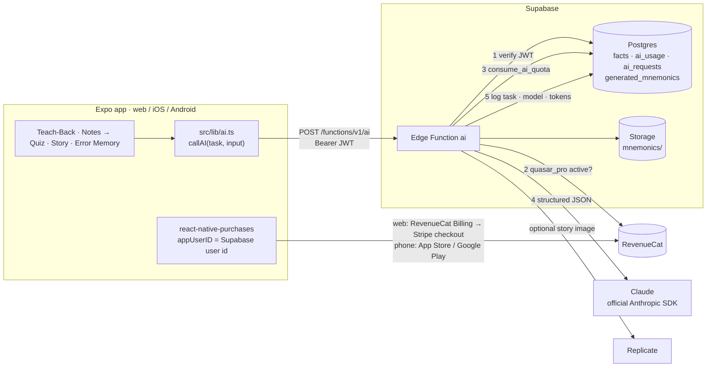

# AI architecture

Quasar's AI features belong to **Quasar Plus**. Four things together decide whether a feature runs and what comes back:
- the learner's signed-in account;
- a RevenueCat entitlement;
- a daily quota;
- a validated call to Claude.

The core learning loop never depends on AI. Every AI feature has an on-device path that works without it.

## One request, step by step

`supabase/functions/ai/index.ts`

1. **Size and shape.** The body is `{ task, input }` and must be under ~7 MB (large enough for a 5 MB PDF). An unknown task is rejected.
2. **Who.** `requireUser` verifies the Supabase JWT.
3. **Allowed.** `requirePlus` asks RevenueCat's REST API whether that same user id has an active `quasar_pro` entitlement. The client never gets a say: a flag sent from the app is ignored.
4. **Valid.** The task's `parse*` function checks and trims the input *before* any quota is spent. Story facts are read from the `facts` table, never from the client.
5. **Quota.** `consume_ai_quota(user, task)` is an atomic, service-role-only counter with per-feature daily limits.
6. **Model.** `runJson` (`_shared/claude.ts`) calls Claude through the official SDK with:
   - a JSON schema through `output_config.format`, so answers always have the expected shape;
   - per-task effort;
   - Anthropic's server-side refusal fallback;
   - a timeout.

   A refusal or a truncated answer becomes a clear error instead of a crash.
7. **Checked.** The task's `check*` function validates the output before anything reaches the learner (details below).
8. **Logged.** Each request writes a row to `ai_requests` (task, model, input/output tokens, status) for cost monitoring. Learners can read only their own rows.

## The four tasks

`supabase/functions/_shared/tasks.ts` is pure TypeScript and unit-tested in `tests/ai.test.ts`.

| Task | Feature | Output | What the server checks | Per day |
| --- | --- | --- | --- | --- |
| `tutor` | Teach-Back → *Ask the AI tutor* | coverage of each of the 3 key ideas with quoted evidence, wrong claims, feedback, one follow-up question | exactly three ideas; only a literal `true` counts as covered; lengths capped. Advice only: the on-device check still decides mastery | 30 |
| `quiz` | Notes → Quiz → *Make an AI quiz* | 8–12 questions with explanation and source quote | four distinct choices, a valid answer index, and **source grounding**: for pasted notes, a question whose quote isn't in the notes is dropped | 5 |
| `story` | *Make this story personal* | 60–100-word mnemonic, optional picture | fact text from the database; only known profile fields; image host allow-listed, size-checked, stored privately with a 1-hour signed URL | 10 |
| `hook` | Error Memory → *Write me a new memory hook* | a new vivid hook aimed at the exact misconception, plus why it helps | the hook must state the correct idea in words (key terms from "what's true"); it's saved *beside* the old cue and only replaces it if the learner marks it as helpful | 15 |

Everything a student writes (explanations, notes, profile fields) is sent as data, and the system prompt tells the model never to follow instructions inside it.

## Purchases

- **Web:** `EXPO_PUBLIC_REVENUECAT_WEB_KEY` is a RevenueCat Billing public key. The SDK opens a Stripe checkout; a sandbox key (`rcb_sb_…`) uses Stripe test cards.
  - Restoring purchases isn't supported on web, so signing in is the restore.
  - The paywall asks for sign-in first, so the purchase is attached to the same user id the server checks.
- **Phones:** the iOS and Android keys, with App Store and Google Play products attached to the same `quasar_pro` entitlement.

## Files

| Path | Role |
| --- | --- |
| `src/lib/ai.ts` | Client: `callAI` plus `gradeExplanation`, `generateQuiz`, `personalizeStory`, `newHook` |
| `src/lib/services.ts` | Supabase client; RevenueCat configuration per platform |
| `supabase/functions/ai/index.ts` | The gateway |
| `supabase/functions/_shared/access.ts` | `requireUser`, `requirePlus`, `consumeQuota`, `logRequest` |
| `supabase/functions/_shared/claude.ts` | The Anthropic SDK call |
| `supabase/functions/_shared/tasks.ts` | Prompts, schemas, input and output checks |
| `supabase/migrations/202609250001_ai_gateway.sql` | `ai_usage`, `ai_requests`, `consume_ai_quota` |

## Secrets

Server secrets are set with `npx supabase secrets set` or `npm run setup:live`, and never go in `EXPO_PUBLIC_*`:
- `ANTHROPIC_API_KEY`
- `REVENUECAT_SECRET_KEY`
- `REPLICATE_API_TOKEN` (optional)
- `AI_MODEL` (optional)

The model defaults to `claude-opus-5`.

## Adding a task

1. Add `parseX`, `xRequest` and `checkX` to `tasks.ts`, with a limit in `DAILY_LIMITS`.
2. Add the same limit to `consume_ai_quota` in a new migration.
3. Add a branch in `ai/index.ts` and a typed wrapper in `src/lib/ai.ts`.
4. Add unit tests in `tests/ai.test.ts`.

## Testing

- **Without keys:**
  - `npm test` covers the task definitions, and the quota and RLS rules in PGlite.
  - The browser tests confirm that every AI entry point falls back cleanly when not connected.
- **Live:** follow `docs/GO-LIVE.md`, then check the `ai_requests` table and `npx supabase functions logs ai`.
